# Maintainer development and release workflow

This guide is for the Helprr maintainer. It describes how to develop a feature,
publish the development image, qualify a release, and promote the tested image to
the stable channel.

The central rule is:

> GitHub Actions builds and publishes Helprr images. Deployment hosts pull and run
> those images. Do not manually build the production image from the `main` branch.

## How to use this guide

Commands are run in three different places:

- **Maintainer workstation:** the checked-out Helprr repository. Git, GitHub CLI,
  versioning, tests, tags, release notes, and digest checks run here.
- **Development/stable Docker host:** the directory containing the relevant Compose
  file and its untracked env file. Backups, pulls, container replacement, and runtime
  smoke tests run here.
- **GitHub:** PR review, CI, Docker publication, digest promotion, and the final release
  page. The `gh` commands in this guide are workstation shortcuts for those actions.

Do not copy a command to the deployment host merely because the preceding command ran
there. Each production section says explicitly when to change machines. Never put SSH
passwords, registry credentials, or env-file contents in a command, script, issue, PR,
or release note. Enter an SSH password only at its interactive prompt.

At every stop gate, stop rather than improvising:

1. A dirty tree contains changes you do not understand.
2. A required CI, test, scan, backup, health, or readiness check fails.
3. Rendered Compose names, images, volumes, or networks do not match the intended stack.
4. The exact image digest differs from the digest being qualified or promoted.
5. A production data-service container would be recreated or a migration target is
   uncertain.

The normal stable-release sequence is:

1. Merge focused feature PRs into `development`.
2. Qualify the resulting `edge` image on isolated development data.
3. Prepare the package version and changelog on `development` through a focused PR.
4. Review and merge `development` into `main` without changing the tested commit.
5. Wait for `main` CI, then push an annotated `vX.Y.Z` tag.
6. Wait for native amd64/arm64 builds and Trivy scans; record the exact manifest digest.
7. Create and validate a production PostgreSQL backup.
8. Deploy the exact `X.Y.Z` image to production, without recreating PostgreSQL or Redis.
9. Smoke-test that exact image, then promote its digest to the channel aliases.
10. Publish the draft GitHub release and verify every public asset.
11. Refresh the isolated `edge` deployment and return the workstation to a clean,
    up-to-date `development` branch.

## The three environments

| Environment | Source | Image | Data |
|---|---|---|---|
| Local feature work | A `feat/*` or `fix/*` branch | Local source through `npm run dev` or a local Docker build | Development database |
| Development deployment | A feature checkout or `development` | Local `helprr-dev:local` build or `ghcr.io/saibarathr/helprr:edge` | Dedicated `helprr_dev` database |
| Stable production | A version tag on `main` | Exact version such as `1.1.0`, later promoted to `stable` | Production database |

Never connect an `edge` deployment to the production PostgreSQL database. A
development image may apply a migration that the currently deployed stable image
cannot reverse.

The development and production environments should also have separate:

- PostgreSQL and Redis volumes.
- `.env` files and secrets.
- VAPID key pairs and push subscriptions.
- Ports, hostnames, and reverse-proxy routes.
- User accounts where practical.
- Arr service test instances, or at minimum cleanup and destructive actions disabled.

Helprr provides a standalone [docker-compose.dev.yml](../docker-compose.dev.yml) and
[.env.dev.example](../.env.dev.example) for this isolation. It can run on the same
Docker host as stable because it uses `helprr-dev`, `helprr-dev-db`, and
`helprr-dev-redis`; app port `3051`; loopback database/Redis ports `5433`/`6380`; and
dedicated `helprr-dev-*` volumes and network. Always pass `--env-file .env.dev` and
`-f docker-compose.dev.yml` together when operating it.

## Branches and image tags

### Branch purpose

- `main` is the default branch and represents stable, released source code.
- `development` contains changes intended for the next release.
- `feat/<name>` contains one new feature.
- `fix/<name>` contains one bug fix.
- `chore/<name>` contains maintenance, documentation, CI, or release work.

Prefer a short-lived branch and PR into `development` instead of pushing unfinished
work directly to `development`. Every push to `development` starts native amd64 and
arm64 image builds.

### Image tag purpose

- `edge` is mutable. Every successful Docker publication from `development` replaces
  it.
- `1.0.1`, `1.1.0`, and similar tags are exact release images. Never overwrite or
  reuse an exact version tag.
- `1.0`, `1.1`, and `1` are release-channel aliases maintained by promotion.
- `stable` is mutable, but only the manual promotion workflow moves it.
- Helprr intentionally does not publish a `latest` tag.

Changing a registry tag does not restart anyone's container. Users receive a newer
image only after pulling and replacing the application container, or through an
external updater they configured themselves. For the maintainer stack, use the scoped
`pull helprr` and `up -d --no-build --no-deps helprr` commands in Part 7.

## What the GitHub workflows do

| Workflow | Trigger | Result |
|---|---|---|
| [CI](../.github/workflows/ci.yml) | Any PR; pushes to `development` or `main` | Installs dependencies, generates Prisma, lints, tests, validates the schema, and builds |
| [Docker publish](../.github/workflows/docker-publish.yml) | Push to `development` | Builds and scans native amd64/arm64 images, then updates `edge` |
| Docker publish | Push of a `vX.Y.Z` tag | Builds exact `X.Y.Z` image and creates a draft GitHub release with deployment assets |
| [Docker promote](../.github/workflows/docker-promote.yml) | Manual workflow dispatch | Verifies a qualified digest, then moves minor, major, and `stable` aliases to it |

A push to `main` runs CI but does **not** publish an image. A version tag is required
to publish an exact release image.

On a push to `development`, CI and Docker publish are separate workflows. Treat the
new `edge` image as deployable only after both workflows are green. The preferred PR
flow ensures the exact commit has already passed CI before it reaches `development`.

## End-to-end flow

```mermaid
flowchart LR
    A["Feature branch"] --> B["PR into development"]
    B --> C["development"]
    C --> D["GitHub builds edge"]
    D --> E["Development deployment"]
    E --> F["Manual verification"]
    F --> G["Prepare release version"]
    G --> H["PR development to main"]
    H --> I["Tag vX.Y.Z"]
    I --> J["GitHub builds exact X.Y.Z image"]
    J --> K["Deploy exact image to production"]
    K --> L["Production smoke test"]
    L --> M["Promote tested digest"]
    M --> N["stable"]
```



## Part 1: develop a feature

### 1. Start from the latest development branch

```bash
git switch development
git pull --ff-only origin development
git status
```

Do not begin with uncommitted changes. Create a branch with a focused name:

```bash
git switch -c feat/my-new-feature
```

For a bug fix:

```bash
git switch -c fix/short-bug-description
```

### 2. Implement and test locally

For the fastest application-development loop, use the existing local environment:

```bash
npm ci
npm run dev
```

For a full local source-based container build, initialize the isolated development
configuration once:

```bash
./scripts/setup-env.sh --dev
# Review the generated development-only values and optional settings.
nano .env.dev

HELPRR_DEV_GIT_SHA="$(git rev-parse --short HEAD)" \
  docker compose --env-file .env.dev -f docker-compose.dev.yml \
  up -d --build
```

This is a complete stack, not an override layered over the stable file. It builds the
current checkout as `helprr-dev:local` and can run beside stable without sharing its
containers or data. Open the source build on port `3051`.

If `prisma/schema.prisma` changes, create and review a migration:

```bash
npm run db:migrate
```

Host-side `db:migrate` and `db:deploy` explicitly read `.env.local`; confirm its
`DATABASE_URL` names the intended development database before running either command.
Do not source `.env.dev` for Prisma: it is a Compose interpolation file and has no
`DATABASE_URL`, so a raw Prisma command could otherwise fall through to a stale `.env`.
The isolated Docker app applies migrations internally against `helprr-dev-db`.

Commit the generated `prisma/migrations/<migration-name>/` directory. Never edit or
delete a migration that has appeared in a published release.

### 3. Run the local gate

At minimum:

```bash
npm run lint
npm test
npm run build
```

CI also starts a disposable PostgreSQL 16 database and runs
`npm run test:migrations`. The migration runner reconstructs every recorded release
snapshot, seeds representative rows, applies the current migrations, and checks both
data preservation and the new schema. For a local run, point
`MIGRATION_TEST_DATABASE_URL` at a disposable database named exactly
`helprr_migration_test`; the script refuses every other database name and clears the
scratch schema afterward. Never point it at `helprr`, `helprr_dev`, or any database
containing data you intend to keep.

For database or release-sensitive changes, also run:

```bash
npx prisma validate
docker compose config --quiet
npm audit --omit=dev --audit-level=high
```

Manually verify the affected UI and API flows. For permission-sensitive work, test an
admin and a restricted member account.

### 4. Commit and push the feature branch

Review exactly what will be committed:

```bash
git status
git diff
git diff --cached
```

Then stage, commit, and push:

```bash
git add path/to/changed-file
git commit -m "feat: add my new feature"
git push -u origin feat/my-new-feature
```

Open a PR from `feat/my-new-feature` into `development`:

```bash
gh pr create \
  --base development \
  --head feat/my-new-feature \
  --title "feat: add my new feature" \
  --body "Summary, verification, and any migration or deployment notes."
```

Wait for CI and review feedback. Do not merge a red PR.

### 5. Merge into development

After approval and green checks, merge the feature PR into `development`. This push
starts two workflows:

1. CI checks the merged commit.
2. Docker publish builds native amd64/arm64 images, blocks fixable high/critical
   vulnerabilities with Trivy, and updates `edge` only after both platform scans pass.

Watch both workflows in the GitHub Actions page, or inspect them with:

```bash
gh run list --branch development --limit 10
```

Do not deploy the new `edge` image if either workflow failed.

## Part 2: deploy and test the development image

The development Compose file supports two modes with the same isolated data.

### Mode A: test the current local source

Leave this value in `.env.dev`:

```dotenv
HELPRR_DEV_IMAGE=helprr-dev:local
```

Build and replace the local development app:

```bash
HELPRR_DEV_GIT_SHA="$(git rev-parse --short HEAD)" \
  docker compose --env-file .env.dev -f docker-compose.dev.yml \
  up -d --build
```

### Mode B: test the published development image

After the `development` CI and Docker workflows pass, set:

```dotenv
HELPRR_DEV_IMAGE=ghcr.io/saibarathr/helprr:edge
```

Pull and replace only the isolated development app:

```bash
./scripts/backup.sh --dev
docker compose --env-file .env.dev -f docker-compose.dev.yml config --services
docker compose --env-file .env.dev -f docker-compose.dev.yml config --images
docker inspect -f '{{.Name}} started={{.State.StartedAt}}' \
  helprr-dev-db helprr-dev-redis
docker compose --env-file .env.dev -f docker-compose.dev.yml pull helprr-dev
docker compose --env-file .env.dev -f docker-compose.dev.yml \
  up -d --no-build --no-deps helprr-dev
```

The helper selects only `helprr-dev-db`, validates the archive, and stores it separately
from stable backups. Do not continue to the pull if backup creation fails.

The same `helprr_dev` database is retained when switching between the local source and
published `edge` modes. It is never the stable `helprr` database.

### Inspect the development stack

```bash
docker compose --env-file .env.dev -f docker-compose.dev.yml ps
docker compose --env-file .env.dev -f docker-compose.dev.yml logs --tail=200 helprr-dev
curl -fsS http://localhost:3051/api/health
curl -fsS http://localhost:3051/api/ready
docker inspect -f 'revision={{index .Config.Labels "org.opencontainers.image.revision"}} version={{index .Config.Labels "org.opencontainers.image.version"}}' helprr-dev
docker inspect -f '{{.Name}} started={{.State.StartedAt}}' \
  helprr-dev-db helprr-dev-redis
```

`/api/ready` must report `database`, `redis`, and `migrations` as `ok`. The PostgreSQL
and Redis start times printed after the app replacement must match the pre-update
values. If they changed unexpectedly, stop and investigate before testing further.

The expected side-by-side layout is:

- Stable app: `http://localhost:3050`.
- Development app: `http://localhost:3051`.
- Development PostgreSQL: `127.0.0.1:5433` only.
- Development Redis: `127.0.0.1:6380` only.

The database and Redis ports are exposed only on loopback for local debugging tools;
they are not reachable from the LAN.

To stop development without touching stable:

```bash
docker compose --env-file .env.dev -f docker-compose.dev.yml down
```

To permanently erase development data only:

```bash
docker compose --env-file .env.dev -f docker-compose.dev.yml down -v
```

Never run the `down -v` command against the normal stable Compose file.

Then check:

- Settings → Status shows `development` plus the expected commit SHA in both modes.
  For published-image testing, `docker compose ... ps` or `docker inspect helprr-dev`
  should identify `ghcr.io/saibarathr/helprr:edge` as the image.
- Login works for admin and member accounts.
- Database migrations completed without errors.
- Redis, polling, and cleanup jobs started normally.
- The new feature works on desktop and relevant PWA devices.
- Push notifications still work if the change touches the service worker,
  subscriptions, polling, or notification delivery.
- No unexpected destructive operation occurs against connected services.
- Settings → Service status shows the expected Helprr version/update state, and an
  admin can download a support bundle whose JSON contains no configured credentials.
- The configured upstream versions still match, or deliberately update, the exact
  point versions in [Upstream compatibility](upstream-compatibility.md). Re-test the
  affected feature before changing a row; never infer an inclusive range from two
  successful versions.

If a problem is found, create another focused branch from the latest `development`,
fix it, and repeat the PR process. Do not release until the complete contents of
`development` are acceptable for stable users.

## Part 3: decide the release version

Use semantic versioning:

- Patch `1.0.1`: backward-compatible bug fixes only.
- Minor `1.1.0`: backward-compatible features or substantial improvements.
- Major `2.0.0`: intentional breaking changes or incompatible migration behavior.
- Release candidate `1.1.0-rc.1`: optional qualification build before a large release.

Do not create a new stable release for every commit. Multiple completed features and
fixes can remain on `development` and `edge` until the next planned release.

## Part 4: prepare the release on development

Set the intended version once in the current workstation shell. The examples use a
future minor release; replace it with the actual semantic version:

```bash
VERSION=1.2.0
TAG="v$VERSION"
IMAGE=ghcr.io/saibarathr/helprr
```

If a shell is closed or a command is run on another machine, set the appropriate
variables again. Before any tag or promotion command, print and visually check them:

```bash
printf 'VERSION=%s TAG=%s IMAGE=%s\n' "$VERSION" "$TAG" "$IMAGE"
```

Make sure all intended work is present and no unfinished work is included:

```bash
git switch development
git pull --ff-only origin development
git status
git log --oneline origin/main..development
RELEASE_BRANCH="chore/release-$VERSION"
git switch -c "$RELEASE_BRANCH"
```

Update `package.json` and `package-lock.json` without creating the Git tag yet:

```bash
npm version "$VERSION" --no-git-tag-version
```

Update `CHANGELOG.md` with the release date and user-facing changes. Also verify:

- `README.md` documents new configuration or behavior.
- `docs/upstream-compatibility.md` records any newly qualified upstream version and
  distinguishes a connection probe from real feature-flow evidence.
- `.env.example` includes new runtime variables without secrets.
- `docker-compose.yml` passes any required runtime variables.
- New Prisma migrations are committed and non-destructive for a patch release.
- The displayed application version matches `$VERSION`.

Run the complete release gate:

```bash
npm run lint
npm test
npm run build
npx prisma validate
docker compose --env-file .env.example -f docker-compose.yml config --quiet
docker compose --env-file .env.dev.example -f docker-compose.dev.yml config --quiet
sh -n scripts/setup-env.sh scripts/backup.sh
npm audit --omit=dev --audit-level=high
git diff --check
```

Commit and push the release preparation branch:

```bash
git add package.json package-lock.json CHANGELOG.md README.md .env.example docker-compose.yml
git add prisma/migrations 2>/dev/null || true
git commit -m "chore(release): prepare Helprr $VERSION"
git push -u origin "$RELEASE_BRANCH"
gh pr create \
  --base development \
  --head "$RELEASE_BRANCH" \
  --title "chore(release): prepare Helprr $VERSION" \
  --body "Version/changelog preparation, complete release-gate evidence, migration notes, and deployment-impact summary."
```

Only stage files that actually belong to the release. The explicit list above is a
review prompt, not a requirement to commit unchanged files.

Wait for CI and review, merge the focused PR into `development`, and then qualify the
resulting `development` commit and `edge` publication again. Release metadata is part
of the image labels, so the final `edge` workflow after release preparation must pass.

```bash
git switch development
git pull --ff-only origin development
test "$(node -p "require('./package.json').version")" = "$VERSION"
gh run list --branch development --limit 10
```

## Part 5: move the qualified source to main

Open a release PR from `development` into `main`:

```bash
gh pr create \
  --base main \
  --head development \
  --title "Release Helprr $VERSION" \
  --body "Release gate results, migration notes, manual tests, and planned production smoke checks."
```

Wait for every PR check to pass. Review the complete diff from `main`—not only the
last feature commit. Record the release PR URL and inspect its checks before merging:

```bash
gh pr list --base main --head development --state open
gh pr checks --watch
```

Resolve valid review findings on a focused branch through `development`, then let the
release PR refresh. Re-run the full gate after material changes. Do not apply a review
suggestion that weakens a fail-closed authorization, ownership, cleanup-correlation, or
data-safety guarantee merely to make the review disappear; document why it is unsafe.

### Preferred fast-forward method

Helprr currently keeps `main` and `development` at the same commit after a release.
After the release PR is reviewed and green:

```bash
git switch development
git pull --ff-only origin development
git fetch origin
git merge-base --is-ancestor origin/main development
git push origin development:main
```

`git merge-base --is-ancestor` prints nothing when successful. If it returns a nonzero
exit status, stop: `main` and `development` have diverged and must be reconciled before
release.

The fast-forward push advances `main` to the exact tested development commit. GitHub
then recognizes the open release PR as merged. Confirm:

```bash
git fetch origin
git rev-parse origin/main
git rev-parse origin/development
gh pr view --json state,mergedAt,url
```

The two commit hashes should match. Record that release commit; the tag, image label,
deployment, and final branch state must all resolve to it.

If a release PR is instead squash-merged or rebased through the GitHub UI, `main` and
`development` will have different histories. Merge `main` back into `development`
before beginning new work so development contains every stable commit.

Wait for the CI run triggered by the `main` update. Do not create the release tag while
that CI run is failing or still in progress.

## Part 6: tag and build the exact release image

Update the local main branch:

```bash
git switch main
git pull --ff-only origin main
```

Confirm the version and commit:

```bash
node -p "require('./package.json').version"
git log -1 --oneline
git status
```

Create an annotated tag and push it:

```bash
test "$(node -p "require('./package.json').version")" = "$VERSION"
test "$(git rev-parse origin/main)" = "$(git rev-parse origin/development)"
git tag -a "$TAG" -m "Helprr $VERSION"
git push origin "$TAG"
```

Wait for the tag run to appear, capture its ID, and monitor that exact run:

```bash
gh run list --workflow docker-publish.yml --branch "$TAG" --limit 5
TAG_RUN_ID=$(gh run list --workflow docker-publish.yml --branch "$TAG" \
  --limit 1 --json databaseId --jq '.[0].databaseId')
test -n "$TAG_RUN_ID"
gh run watch "$TAG_RUN_ID" --exit-status --compact
```

Never move or reuse a published release tag. If a mistake is discovered after
publication, fix it in a new version such as `1.1.1`.

The version-tag push causes Docker publish to:

1. Build the exact commit natively for amd64 and arm64.
2. Create the multi-architecture `ghcr.io/saibarathr/helprr:$VERSION` manifest.
3. Create a draft GitHub release.
4. Attach `docker-compose.yml`, `env.example`, `setup-env.sh`, and `backup.sh` from
   that exact tag. These are the complete no-clone install and backup assets.

At this point `stable` still points to the previous qualified release.

Wait for Docker publish to finish successfully. Obtain the exact manifest digest:

```bash
DIGEST=$(docker buildx imagetools inspect \
  "$IMAGE:$VERSION" \
  | awk '/^Digest:/ {print $2; exit}')
printf 'Qualified candidate: %s@%s\n' "$IMAGE" "$DIGEST"
test -n "$DIGEST"
test "$(git rev-parse "$TAG^{}")" = "$(git rev-parse origin/main)"
```

Record this digest in the release notes or release checklist. Inspect the manifest and
draft release before touching production:

```bash
docker buildx imagetools inspect "$IMAGE:$VERSION"
gh release view "$TAG" --json url,isDraft,isPrerelease,name,tagName,assets
```

The manifest must contain native `linux/amd64` and `linux/arm64` entries, and both
platform jobs must have passed Trivy. The release must still be a draft and contain
exactly these assets from the tagged commit:

- `docker-compose.yml`
- `env.example`
- `setup-env.sh`
- `backup.sh`

Do not publish the draft merely to make its asset URLs public. Production qualification
comes first.

## Part 7: qualify the exact image in production

Do not qualify `stable`, because it still refers to the old release. Pin production to
the new exact version first. This is the only normal release section that mutates the
stable installation. Announce the planned mutation, use an interactive SSH login, and
do not print or copy the production `.env`.

### 1. Inspect the stable target before changing it

On the **deployment host**, enter the stable Compose directory and run read-only
inspection first:

```bash
pwd
docker ps --format 'table {{.Names}}\t{{.Image}}\t{{.Status}}\t{{.Ports}}'
docker compose config --services
docker compose config --images
docker compose config --volumes
docker compose config --networks
docker inspect -f '{{.Name}} started={{.State.StartedAt}}' \
  helprr-db helprr-redis
awk -F= '$1 == "HELPRR_VERSION" {print "HELPRR_VERSION=" $2}' .env
```

Do not run full `docker compose config` in copied logs because it renders environment
values. The stable result must contain only `helprr`, `helprr-db`, and `helprr-redis`,
with stable volumes/network. If any `helprr-dev-*` name appears, stop. Record the
PostgreSQL and Redis start times so they can be compared after the app update.

Optionally record simple data-preservation baselines without exposing row contents:

```bash
docker compose exec -T helprr-db sh -ceu '
export PGPASSWORD="$POSTGRES_PASSWORD"
psql --username="$POSTGRES_USER" --dbname="$POSTGRES_DB" --tuples-only <<SQL
\echo users
SELECT count(*) FROM "User";
\echo service_connections
SELECT count(*) FROM "ServiceConnection";
\echo applied_migrations
SELECT count(*) FROM "_prisma_migrations"
WHERE finished_at IS NOT NULL AND rolled_back_at IS NULL;
SQL
'
```

### 2. Ensure the exact backup helper is available

Normal no-clone installations have `scripts/backup.sh`. If an older installation does
not, remember that the new release is still a draft, so its public download URL does
not work yet. Copy the helper from the exact tagged workstation checkout instead of
publishing the release early.

On the **workstation**, after confirming `main` and `$TAG` are the same commit:

```bash
DEPLOY_HOST=user@server
DEPLOY_DIR=/path/to/helprr
test "$(git rev-parse "$TAG^{}")" = "$(git rev-parse HEAD)"
BACKUP_HELPER=$(mktemp /tmp/helprr-backup-helper.XXXXXX)
trap 'rm -f "$BACKUP_HELPER"' EXIT
git show "$TAG:scripts/backup.sh" > "$BACKUP_HELPER"
chmod 700 "$BACKUP_HELPER"
ssh "$DEPLOY_HOST" "mkdir -p '$DEPLOY_DIR/scripts'"
scp "$BACKUP_HELPER" \
  "${DEPLOY_HOST}:${DEPLOY_DIR}/scripts/backup.sh"
shasum -a 256 "$BACKUP_HELPER"
rm -f "$BACKUP_HELPER"
trap - EXIT
```

Enter the SSH password only at the interactive prompts. Then, on the **deployment
host**, restrict the helper and compare its printed SHA-256 with the workstation value:

```bash
chmod 700 scripts/backup.sh
sha256sum scripts/backup.sh
```

### 3. Take a protected PostgreSQL backup

From the stable Compose directory on the **deployment host**:

```bash
./scripts/backup.sh --stable
```

The helper creates a transactionally consistent custom-format dump while Helprr stays
online, validates the archive with `pg_restore --list`, publishes it atomically under
`backups/stable/`, and applies directory/file permissions `0700`/`0600`. It does not
stop, restart, update, or migrate any container. Stop qualification if it fails.

Keep the resulting backup until the release has been stable long enough for your risk
tolerance. Database dumps contain API keys and password hashes and must be treated as
secrets. Archive validation is not a substitute for periodic isolated restore tests.

### 4. Pin and verify the exact image

Set the release values again on the **deployment host**, copying `$DIGEST` exactly from
the successful tag workflow:

```bash
VERSION=1.2.0
IMAGE=ghcr.io/saibarathr/helprr
EXPECTED_DIGEST=sha256:replace-with-qualified-digest
printf 'Deploying %s:%s at %s\n' "$IMAGE" "$VERSION" "$EXPECTED_DIGEST"
```

Open `.env` in an editor and change only this line; never echo the full file:

```dotenv
HELPRR_VERSION=1.2.0
```

Confirm the safe value and rendered image, then pull without starting anything:

```bash
awk -F= '$1 == "HELPRR_VERSION" {print "HELPRR_VERSION=" $2}' .env
docker compose config --images
docker compose pull helprr
docker image inspect "$IMAGE:$VERSION" --format '{{json .RepoDigests}}'
docker image inspect "$IMAGE:$VERSION" --format '{{json .RepoDigests}}' \
  | grep -Fq "$IMAGE@$EXPECTED_DIGEST"
```

The final command must succeed before replacement. It proves that the pulled platform
image belongs to the qualified multi-architecture digest.

### 5. Replace only the stable application

```bash
docker compose up -d --no-build --no-deps helprr
```

Always name `helprr` and use `--no-deps` during a stable release. Do not use an
unscoped `docker compose up -d`, and never use `down` or `down -v`. The image entrypoint
applies committed Prisma migrations before starting Next.js; PostgreSQL and Redis must
remain running throughout.

Wait for the app healthcheck, then verify both probes and the image identity:

```bash
docker compose ps helprr
curl -fsS http://localhost:3050/api/health
curl -fsS http://localhost:3050/api/ready
docker inspect -f 'revision={{index .Config.Labels "org.opencontainers.image.revision"}} version={{index .Config.Labels "org.opencontainers.image.version"}} started={{.State.StartedAt}}' helprr
docker inspect -f '{{.Name}} started={{.State.StartedAt}}' \
  helprr-db helprr-redis
docker compose logs --tail=250 helprr
```

Readiness must report `database`, `redis`, and `migrations` as `ok`. PostgreSQL and Redis
start times must match the pre-update values. Re-run the baseline count command and
confirm users and service connections are unchanged while the migration count is the
expected current value.

Also verify:

- Settings → Status displays `$VERSION` and the tagged commit SHA.
- Existing users, service connections, preferences, and history remain present.
- Admin and restricted-member login work.
- Sonarr, Radarr, Lidarr, qBittorrent, Prowlarr, Jellyfin, and other configured services
  still connect as applicable.
- Polling and cleanup schedulers start normally.
- Existing push subscriptions receive a test notification.
- The new feature and its most important failure path work.
- Any affected delete action is permission-checked and audited.
- Container stop/replacement drains background work normally when relevant.

Do not proceed to promotion if any result is uncertain.

### Rollback rule

If no new migration was applied, pin the previous exact version and recreate the app
container.

If the new release applied a migration and the previous version is not compatible,
stop the application and restore the matching pre-upgrade PostgreSQL backup. Do not
attempt an unsupported downgrade across migrations. See [README.md](../README.md) for
the complete restore procedure.

## Part 8: promote the tested digest to stable

Once the exact image has passed production verification, run the manual promotion
workflow from the **workstation**. Re-set and print `VERSION`, `IMAGE`, and `DIGEST`
before dispatching if this is a new shell:

```bash
PROMOTION_URL=$(gh workflow run docker-promote.yml \
  --ref main \
  -f version="$VERSION" \
  -f source_digest="$DIGEST")
printf '%s\n' "$PROMOTION_URL"
PROMOTION_RUN_ID=${PROMOTION_URL##*/}
gh run watch "$PROMOTION_RUN_ID" --exit-status --compact
```

The workflow first verifies that the exact version tag resolves
to the supplied digest. It then moves these aliases to that exact manifest:

- the matching minor alias, such as `1.2`
- the matching major alias, such as `1`
- `stable`

It does not rebuild the image during promotion.

Verify the aliases manually if desired:

```bash
MAJOR=${VERSION%%.*}
REST=${VERSION#*.}
MINOR="$MAJOR.${REST%%.*}"
for tag in "$VERSION" "$MINOR" "$MAJOR" stable; do
  docker buildx imagetools inspect \
    "$IMAGE:$tag" \
    | awk -v tag="$tag" '/^Digest:/ {print tag, $2; exit}'
done
```

Every printed digest must match `$DIGEST`.

## Part 9: publish the GitHub release

The tag workflow creates a draft release. Before publishing it:

1. Give it a clear title such as `Helprr $VERSION`.
2. Summarize user-visible features and fixes.
3. Call out configuration changes and migrations.
4. Include update and backup guidance.
5. Confirm `docker-compose.yml`, `env.example`, `setup-env.sh`, and `backup.sh` are
   attached and downloadable.
6. Include the qualified multi-arch digest.
7. Mark a stable release as the latest release, not as a prerelease.

Prepare the notes in a local file, then publish from the **workstation**:

```bash
gh release edit "$TAG" \
  --title "Helprr $VERSION" \
  --notes-file /path/to/release-notes.md \
  --draft=false \
  --latest
gh release view "$TAG" \
  --json url,isDraft,isPrerelease,name,tagName,publishedAt,assets
gh api repos/SaiBarathR/helprr/releases/latest --jq '.tag_name'
```

The release must be public, not a prerelease, and returned by the `latest` endpoint.
Verify the public unauthenticated asset URLs—not only authenticated `gh` downloads—and
compare every file with the tagged source:

```bash
ASSET_DIR=$(mktemp -d /tmp/helprr-release-assets.XXXXXX)
ASSET_BASE="https://github.com/SaiBarathR/helprr/releases/download/$TAG"
for asset in docker-compose.yml env.example setup-env.sh backup.sh; do
  curl -fsSL -o "$ASSET_DIR/$asset" "$ASSET_BASE/$asset"
done

for mapping in \
  docker-compose.yml:docker-compose.yml \
  env.example:.env.example \
  setup-env.sh:scripts/setup-env.sh \
  backup.sh:scripts/backup.sh; do
  asset_name=${mapping%%:*}
  source_name=${mapping#*:}
  actual=$(shasum -a 256 "$ASSET_DIR/$asset_name" | awk '{print $1}')
  expected=$(git show "$TAG:$source_name" | shasum -a 256 | awk '{print $1}')
  test "$actual" = "$expected"
  printf '%s matches tagged source: %s\n' "$asset_name" "$actual"
done

sh -n "$ASSET_DIR/setup-env.sh" "$ASSET_DIR/backup.sh"
docker compose --env-file "$ASSET_DIR/env.example" \
  -f "$ASSET_DIR/docker-compose.yml" config --quiet
```

Only after publication can older no-clone installations use the public exact-version
URLs for the new helpers. Remove the temporary directory after recording the successful
checks.

## Part 10: refresh isolated edge and close the release

If the maintainer Docker host runs the isolated development stack, finish by ensuring
it has the final `edge` image from the release commit. On the **deployment host**:

```bash
docker compose --env-file .env.dev -f docker-compose.dev.yml config --services
docker compose --env-file .env.dev -f docker-compose.dev.yml config --images
docker inspect -f '{{.Name}} started={{.State.StartedAt}}' \
  helprr-dev-db helprr-dev-redis
./scripts/backup.sh --dev
docker compose --env-file .env.dev -f docker-compose.dev.yml pull helprr-dev
docker compose --env-file .env.dev -f docker-compose.dev.yml \
  up -d --no-build --no-deps helprr-dev
curl -fsS http://localhost:3051/api/health
curl -fsS http://localhost:3051/api/ready
docker inspect -f 'revision={{index .Config.Labels "org.opencontainers.image.revision"}} version={{index .Config.Labels "org.opencontainers.image.version"}}' helprr-dev
docker inspect -f '{{.Name}} started={{.State.StartedAt}}' \
  helprr-dev-db helprr-dev-redis
```

Confirm the development PostgreSQL and Redis start times are unchanged. This step must
use `docker-compose.dev.yml`, `.env.dev`, and the `helprr-dev` service only; never point
`edge` at stable data.

Finally, on the **workstation**, return to `development` and confirm the complete
release state:

```bash
git switch development
git pull --ff-only origin development
git fetch origin --tags
git status --short --branch
git diff --check
git rev-parse origin/main
git rev-parse origin/development
git rev-parse "$TAG^{}"
test "$(git rev-parse origin/main)" = "$(git rev-parse origin/development)"
test "$(git rev-parse origin/main)" = "$(git rev-parse "$TAG^{}")"
gh release view "$TAG"
gh run list --limit 10
```

The normal completed state is:

- `main` and `development` contain the release commit.
- `$TAG` points to the intended release source commit.
- CI and Docker publish are green.
- The exact version and stable aliases resolve to the qualified digest.
- The production deployment remains pinned to the exact version used for the smoke
  test.
- The GitHub release is public and all four matching deployment assets work through
  unauthenticated exact-version URLs.
- Stable and isolated-development liveness/readiness pass, and neither data-service
  pair was recreated during its application refresh.

Leaving the maintainer production instance pinned to the exact version is recommended.
End users who omit `HELPRR_VERSION` follow `stable` on their next pull.

Record the completion date, release PR, release commit, CI/Docker run URLs, qualified
digest, protected backup path, production/development smoke evidence, promotion result,
and public asset verification in the current local release plan. Do not mark the plan
complete before every applicable check above passes.

## Emergency patch workflow

For a production bug that cannot wait for the next feature release:

1. Branch from `main`, not from unreleased `development`.
2. Implement only the fix and regression tests.
3. Bump the patch version, for example `1.0.0` → `1.0.1`.
4. Update `CHANGELOG.md`.
5. Open a PR into `main` and require the full release gate.
6. Tag `v1.0.1`, build the exact image, back up production, deploy it, and smoke-test.
7. Promote its digest to `1.0`, `1`, and `stable` through Docker promote.
8. Publish the patch release.
9. Merge the completed `main` hotfix back into `development` so the fix is not lost
   from the next feature release.

Example start:

```bash
git switch main
git pull --ff-only origin main
git switch -c fix/production-problem
npm version 1.0.1 --no-git-tag-version
```

Do not merge all unreleased development features into an emergency patch.

## Common mistakes and what they mean

### "I merged into main, but no new stable image appeared"

This is expected. A `main` push runs CI only. Push a version tag to build an exact
release, qualify that image, and then run Docker promote.

### "I pushed to development, but my development server still runs old code"

Wait for Docker publish to finish, then run:

```bash
docker compose --env-file .env.dev -f docker-compose.dev.yml pull helprr-dev
docker compose --env-file .env.dev -f docker-compose.dev.yml \
  up -d --no-build --no-deps helprr-dev
```

Confirm `.env.dev` contains
`HELPRR_DEV_IMAGE=ghcr.io/saibarathr/helprr:edge` and check Settings → Status.

### "Stable was promoted, but users are still on the old version"

Promotion updates the registry alias only. Existing containers do not change until
users pull and recreate them.

### "My exact version does not update after a new stable release"

This is correct. A deployment pinned to `HELPRR_VERSION=X.Y.Z` remains on that version
until the owner changes that value.

### "The backup helper is missing while the release is still a draft"

Do not publish early. Copy `scripts/backup.sh` from the exact tagged workstation
checkout to the deployment directory, compare SHA-256 values, set mode `0700`, and run
it before changing the stable env or image. Public release-asset URLs work only after
the release is published.

### "Updating Helprr also restarted PostgreSQL or Redis"

The normal release command must name only the app:
`docker compose up -d --no-build --no-deps helprr`. Record the data-service start times
before and after. Never use `down` or `down -v` during an update.

### "Health passes but readiness fails"

`/api/health` proves only that the Node process responds. Do not qualify or promote the
release until `/api/ready` also returns HTTP 200 with database, Redis, and migrations
all `ok`.

### "My development stack collides with production"

Use `docker-compose.dev.yml` by itself with `--env-file .env.dev`; do not layer it over
`docker-compose.yml`. Confirm the development containers and volumes all start with
`helprr-dev`. If stable container names appear in the rendered config, stop before
running it.

### "The old image will not start after testing edge"

The edge image may have applied a newer migration. Do not point edge at production
data. Restore a matching backup instead of attempting an unsupported downgrade.

### "A release tag contains the wrong code"

Do not move a published tag. Fix the source, bump to the next patch version, and publish
a new release.

## Short feature checklist

- [ ] Branch created from current `development`.
- [ ] Feature implemented without unrelated changes.
- [ ] Migration created and reviewed if the schema changed.
- [ ] Lint, tests, and production build pass.
- [ ] Affected admin/member and mobile/PWA flows verified.
- [ ] Feature PR merged into `development`.
- [ ] Development CI and Docker publish are green.
- [ ] `edge` deployed against isolated development data.
- [ ] Settings → Status shows the expected commit.
- [ ] Manual feature and regression tests pass.

## Short stable-release checklist

- [ ] All contents of `development` are intended for release.
- [ ] Correct patch/minor/major version selected.
- [ ] Package version, lockfile, changelog, docs, env, Compose, and migrations reviewed.
- [ ] Full release gate passes.
- [ ] Release PR into `main` is reviewed and green.
- [ ] `main` and `development` are synchronized.
- [ ] Annotated `vX.Y.Z` tag points to the intended commit.
- [ ] Exact multi-arch image build succeeds.
- [ ] Qualified manifest digest recorded.
- [ ] Draft release contains all four exact-tag assets.
- [ ] Stable Compose services/images/volumes/networks inspected before mutation.
- [ ] Protected production backup created and validated.
- [ ] Pulled exact image resolves to the qualified digest before replacement.
- [ ] Exact version deployed app-only; production liveness/readiness and smoke tests pass.
- [ ] Stable PostgreSQL/Redis were not recreated and data baselines are preserved.
- [ ] Tested digest promoted to minor, major, and `stable` aliases.
- [ ] Draft GitHub release reviewed and published with all four deployment assets.
- [ ] Public assets match tagged files and downloaded Compose renders successfully.
- [ ] Isolated `edge` refreshed app-only; development liveness/readiness pass.
- [ ] Public release page, image aliases, workflows, branch/tag alignment, and local
      release plan verified.
